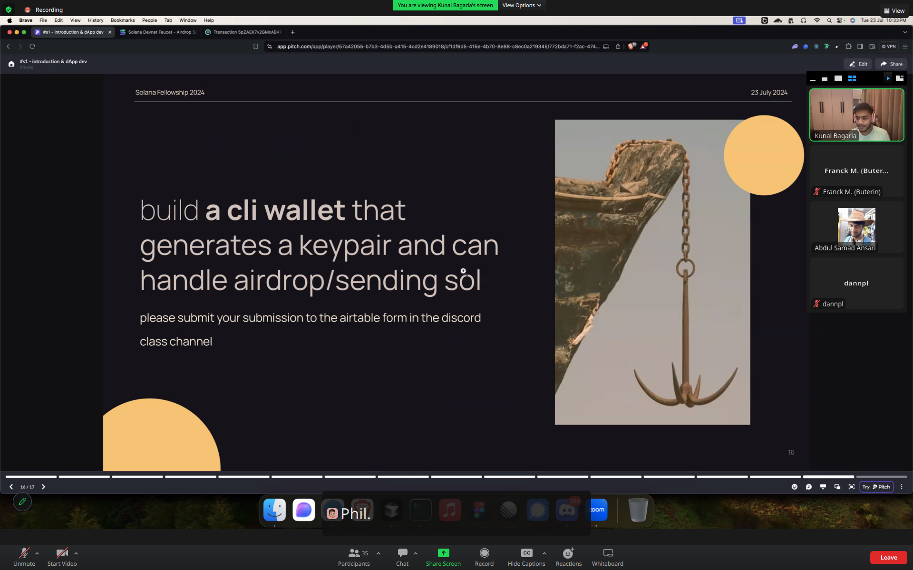

# exo_s1



Build **a cli wallet** that generates a keypair and can handle airdrop/sending sol.

## Install

Install **bun**
`curl -fsSL https://bun.sh/install | bash`

`bun --help`

To install dependencies:

```bash
bun install
```

This project was created using `bun init` in bun v1.1.20. [Bun](https://bun.sh) is a fast all-in-one JavaScript runtime.

If you occure this problem: `bigint: Failed to load bindings, pure JS will be used (try npm run rebuild?)`, resolve it by running the following command `npm rebuild`

## Commands

- `bun run cli.ts wallet --name <name>` : Create \<name>.wallet.json file, with key pair in it !
- `bun run cli.ts balance --name <name>` : Get balance of an \<name> account wallet !
- `bun run cli.ts airdrop --name <name> --amount <amount>` : Get balance of \<amount> SOL for \<name> account wallet !
- `bun run cli.ts transfer --from <fromName> --to <toName> --amount <amount>` : Transfer \<amount> SOL from \<fromName> to \<toName> !

Running local validator : `solana-test-validator --reset`

## Example
```bash
$ bun run cli.ts wallet --name alice

Create Key Pair into "alice.wallet.json" file !
8CKNd7tkcYRkcLJfif6yurLp2khfRp6ECvRbunEH85iM

```
```bash
$ bun run cli.ts wallet --name bob

Create Key Pair into "bob.wallet.json" file !
CXzmHbMxx1drjk42hshaP6R6m2i2btLnpm3hZoMMSA9L

```
```bash
$ ls -l *.wallet.json
.rw-rw-r-- 173 franck 25 juil. 21:31 alice.wallet.json
.rw-rw-r-- 173 franck 25 juil. 21:31 bob.wallet.json

```
```bash
$ bun run cli.ts balance --name alice

Get balance from "alice.wallet.json" file !
Balance (alice): 0

```
```bash
$ bun run cli.ts balance --name bob

Get balance from "bob.wallet.json" file !
Balance (bob): 0

```
```bash
$ bun run cli.ts airdrop --name alice --amount 3

Get aidrop to "alice" !

(Please wait few seconds before any other operation...)

```
```bash
$ bun run cli.ts balance --name alice

Get balance from "alice.wallet.json" file !
Balance (alice): 3

```
```bash
$ bun run cli.ts transfer --from alice --to bob --amount 1

Get data (from) "alice" !
8CKNd7tkcYRkcLJfif6yurLp2khfRp6ECvRbunEH85iM
Get data (to) "bob" !
CXzmHbMxx1drjk42hshaP6R6m2i2btLnpm3hZoMMSA9L
Signature:  2HN12DMYb86fqJDLUvzTxmjwWU65whu9dyJ5K8wYnzedJrwGfRB7sQC1aYajZgGmU5pTpejJDWxDGBmaCQD5PZ5v

(Please wait few seconds before any other operation...)

```
```bash
$ bun run cli.ts balance --name alice

Get balance from "alice.wallet.json" file !
Balance (alice): 1.999995
```
```bash
$ bun run cli.ts balance --name bob

Get balance from "bob.wallet.json" file !
Balance (bob): 1

```

All the operation has been made on a **local node validator** instead of **devnet**, because of aidrop problems...

By running `solana-test-validator` !

⚠️ Beware it creates local files and directories at the current working directory.

**cli.ts:**
```typescript
const connection = new Connection("http://localhost:8899");
//const connection = new Connection("https://api.devnet.solana.com");
```

## Resources

- [Bun — A fast all-in-one JavaScript runtime](https://bun.sh/)
- [bigint: Failed to load bindings, pure JS will be used (try npm run rebuild?) when importing Connection from @solana/web3.js - Solana Stack Exchange](https://solana.stackexchange.com/questions/4077/bigint-failed-to-load-bindings-pure-js-will-be-used-try-npm-run-rebuild-whe)
- [Solana Devnet Faucet - Airdrop SOL](https://faucet.solana.com/)